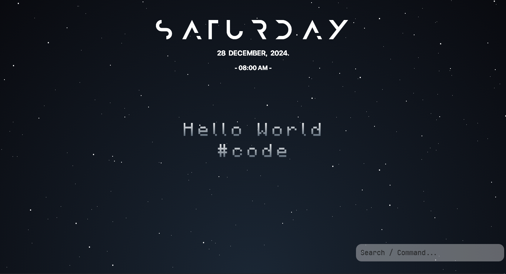
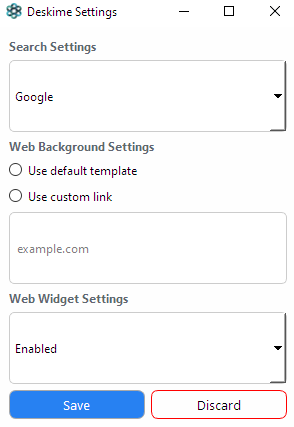

# Deskime



Deskime is a desktop customization application developed in Python.

------------

## Features

-  **Customizable Search Bar**: Located at the bottom of the screen, it allows users to set custom commands (e.g., typing "news" redirects to bbc.com).
  
-  **Calculator Functionality**: The search bar can perform calculations and will send notifications for math-related queries.

-  **Persistent Date and Time Widget**: This widget remains on top of the desktop without interfering with other applications.

-  **Custom Backgrounds**: Users can set a custom webpage or HTML site as their desktop background, or choose from a selection of simple animated backgrounds.

- **Website Widget**: An optional widget in the top corner provides quick access to any website (e.g., news) directly from the desktop, eliminating the need to open additional applications.

### Tested On

- **Python Version**: Python 3.9 (64-bit)

### Prerequisites

- [x] Python 3.8 or higher
- [x] Pythonw (typically installed with Python, used for console-less execution)
- [x] pip
- [x] Windows 10 or higher (currently not supported on Mac)

## Setup

1. ⭐ Star and `clone` this repository
	
2.  Run the following Command
```
python setup.py
```
- This command verfies all the system requirements, downloads all necessary dependencies and fonts, launches the main Python file, and creates a shortcut in the `shell:startup` folder to ensure the application runs automatically at startup.

3. A pop-up app will open. Use this to select your desired settings. Restart your computer for these changes to take place.



### Customizing Search Options

Edit the code to create custom commands such as Shut Down command shown below
```python
# To shut down the PC when "shutdown" is entered in the search bar
if query == "shutdown":
    os.system("SlideToShutdown")  # Use SlideToShutdown
```

### Support Us
If you appreciate our initiative, don't forget to star us, share this to others and donate by opening a discussion at [Deskime-Discussions](https://github.com/Deskime/Deskime_Customization/discussions/1) and and messaging `Donate`.
<br><br>

### Special Thanks to
[CodePen User Sarazond](https://codepen.io/sarazond/pen/LYGbwj) for providing the default template.
